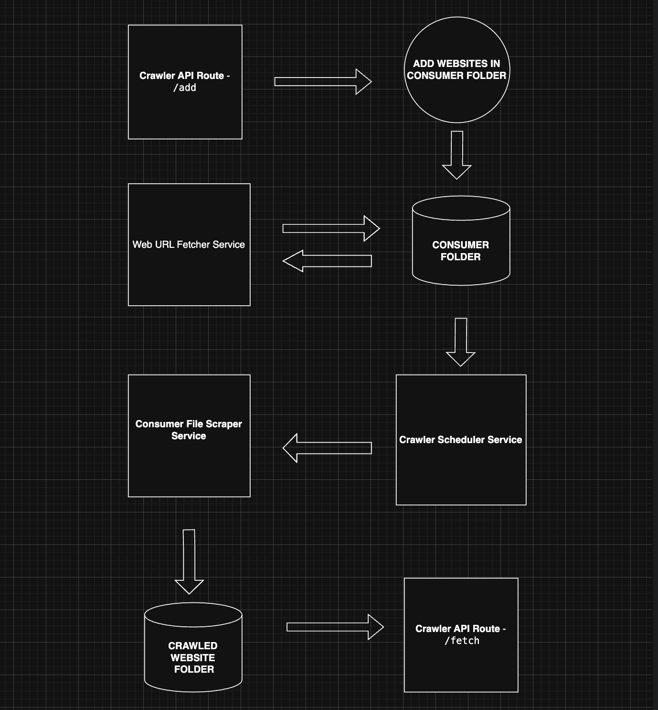

# WEB CRAWLER ✨🚀📈

## 🚀 Getting Started 🚀

### Prerequisites 📖

You should have node install in your system .

### Installation ⌛

1. Clone this repo
   ```sh
   git clone https://github.com/kslji/crawler.git
   ```
2. Install NPM packages
   ```sh
   npm i
   ```
   <br>
3. Run api 
   - Nodemon (will automatically restart the process api.)
    ```sh
      nodemon crawler.api.js
    ```
   - PM2 
    ```sh
      pm2 start crawler.api.js --no-autorestart
    ```
4. Run services
 - Node
    ```sh
      node web.url.fetcher.service
      node crawler.scheduler.service
      node consumer.file.scraper.service
    ```
   - PM2 
    ```sh
        pm2 start web.url.fetcher.service.js --no-autorestart
        pm2 start crawler.scheduler.service.js --no-autorestart
        pm2 start consumer.file.scraper.js --no-autorestart
    ```
    
### OBJECTIVE 🔎

Design and implement a web crawler whose primary task is to discover and list all product URLs across multiple e-commerce websites. Add as many websites as much system will extract all product links from that website homepage urls.

##### TESTED WEBSITES 

```
baccabucci.com
www.adidas.co.in
www.jackjones.in
www.limeroad.com
wildcraft.com
headsupfortails.com
thehouseofrare.com
```


### APPROACH 💡
The system is designed with APIs to add website URLs and retrieve product URLs. To ensure horizontal scalability, the architecture includes three core services:

##### Consumer Folder 📁 : 

Stores each website and its respective categories.

##### Crawler Scheduler Service 🚂 :

- Deploys multiple processes for each website using PM2. This ensures that even if the system is restarted, the processes will continue running in the background.

- Each website is handled by its own process to process categories efficiently and store the final product link list in the crawled-websites folder.

##### Consumer File Scraper Service ( TEMPLATE FILE ) 🚂:

- Serves as a template for scraping product links from category pages. 
- Designed for horizontal scaling—multiple processes can run simultaneously to handle increased system load. The number of processes can be adjusted dynamically based on system requirements

### EXTRA 🤯
(NO DUPLICATION OF PRODUCT URLS)

- Multiple websites have different pattern to fetch product urls therefore have made two different functions to extract product urls.
- authorizeProductUrlFetcher function : Fetches and authorizes product URLs from a Puppeteer page. Saves extracted links to cache for future reference.

```sh
async function authorizeProductUrlFetcher(page, url, fileName) {
    let productLinks = await extractPageProductLinksV1(page);

    if (!await fileUtil.doesFileExistInFolder(
        path.join(__dirname, "../cache.data"),
        fileName + ".json",
    )) {
        if (productLinks.length === 0) {
            fs.writeFileSync(path.join(__dirname, `../cache.data/${fileName}.json`), JSON.stringify({ value: false }), 'utf8');
        } else {
            fs.writeFileSync(path.join(__dirname, `../cache.data/${fileName}.json`), JSON.stringify({ value: true }), 'utf8');
        }
    }

    if (!await fileUtil.getCachedData(fileName)) {
        console.log("Fallback to extractPageProductLinksV1 as no links found.");
        productLinks = await extractPageProductLinksV2(page, url);
    }
    return productLinks;
    }
```
(Extracts product-specific links from a Puppeteer page instance.
 Filters links containing specific keywords like "/products/", "/items/", or "/p/".)
```sh
async function extractPageProductLinksV1(page) {
    const productLinks = await page.evaluate(() => {
        const links = Array.from(document.querySelectorAll("a"))
            .filter(
                (anchor) =>
                    anchor.href.includes("/products/") ||
                    anchor.href.includes("/items/") ||
                    anchor.href.includes("/p/"),
            )
            .map((anchor) => anchor.href)

        return [...new Set(links)]
    })
    return productLinks
}
```

( Extracts product-specific links from a Puppeteer page instance based on URL structure.
  Avoids certain category and page links to refine the product URLs.)

```sh
async function extractPageProductLinksV2(page, url) {
    const parts = url.split('/');
    const categoryPart = parts[parts.length - 1];
    const productLinks = await page.evaluate((categoryPart, parts) => {
        const links = Array.from(document.querySelectorAll("a"))
            .filter(
                (anchor) =>
                    anchor.href !== `https://${parts[2]}/${categoryPart}` &&
                    anchor.href.split("/").length !== (url).split("/").length &&
                    anchor.href.includes(categoryPart)
            )
            .map((anchor) => anchor.href)
        return [...new Set(links)]
    }, categoryPart, parts)
    return productLinks
}
```

- Created a cache.data directory to store cached file data, with files named according to the corresponding website name.

```sh
async function getCachedData(filename) {
    try {
        let data = await fs.readFile(path.join(__dirname, `../cache.data/${filename}.json`), "utf8");
        data = JSON.parse(data);
        return data["value"]
    } catch (err) {
        console.error('Error reading or parsing the file:', err);
    }
}
```

- Batch Processing: Product links are extracted in batches of 5 pages at a time (configurable). Utilizes Promise.all for multithreading, enhancing performance and efficiency.

- Robustness: For large websites, the Puppeteer package is used to handle dynamic content and ensure robust scraping.

### NOTE 🫠

Some additional features can be implemented for improved functionality. However, due to limited resources and cost constraints, the system has been configured to be cost-efficient:

##### IP Rotation: 🥸
- Requires a private server to set up Nginx for IP rotation.

- Configuring Nginx would allow website requests to use different IPs, improving reliability and bypassing potential rate limits.

## Working 📖 ✅



### Crawler API Route - /add :

Used to add websites to the consumer folder. This is a good entry point for initializing the crawling process.

### Consumer Folder :

Acts as storage for the added websites and their category links. This modular design makes it easy to manage multiple websites.

### Web URL Fetcher Service :

Responsible for adding all category links from the consumer folder. This helps in organizing data before deeper crawling begins.

### Consumer File Scraper Service :

Consumes categories and produces product links.
The "multi-file scheduler" ensures scalability, allowing parallel processing of files for efficiency.

### Crawler Scheduler Service :

Schedules consumer/website files for extracting product links. This service introduces automation, ensuring timely crawling.

### Crawled Website Folder :

Stores the extracted product links, maintaining separation of raw and processed data.

### Crawler API Route - /fetch :

Provides a way to retrieve crawled data, making it accessible for downstream processes.

### HOW API WORKS 🧐

- To add websites to the consumer folder, use the /add endpoint:
#### Request:
```
   POST http://localhost:5001/crawler/add
   Content-Type: application/json

  {
    "urls": [
    "https://headsupfortails.com",
    "https://wildcraft.com"
     ]
  }
```
- To get processed product URLs from a specific website, use the /fetch endpoint:
#### Request:
```
    GET http://localhost:5001/crawler/fetch?weburl:"https://headsupfortails.com"
```

### Key Features ✨:

- URL Discovery: Intelligently discovers product pages by recognizing various URL patterns (e.g., /product/, /item/, /p/).

- Scalability: Handles large websites with deep hierarchies and numerous products efficiently.

- Performance: Executes tasks in parallel or asynchronously, minimizing runtime, especially for large sites.

- Robustness: Handles edge cases such as infinite scrolling or dynamically loaded content.


